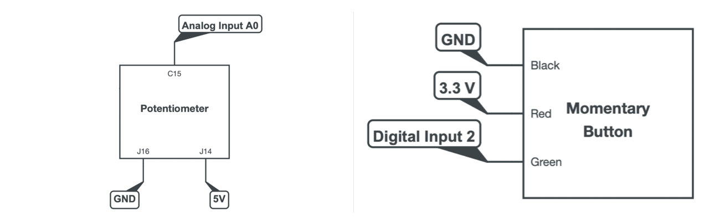

# CMLS-Project

    

## Group:

* #### Chiara Auriemma &nbsp;([@ChiaraAuriemma](https://github.com/ChiaraAuriemma))  10722613 &nbsp;&nbsp; chiara.auriemma@mail.polimi.it
  
* #### Veronica Coccoli &nbsp;([@vanishady](https://github.com/vanishady))  10706276 &nbsp;&nbsp; veronica.coccoli@mail.polimi.it
  
* #### Anna Fusari &nbsp;([@AnnaFusari](https://github.com/AnnaFusari))  10561236 &nbsp;&nbsp; anna.fusari@mail.polimi.it
  
* #### Mattia Martelli &nbsp;([@laughinginloud](https://github.com/laughinginloud))  10684872 &nbsp;&nbsp; mattia.martelli@mail.polimi.it
  
* #### Filippo Marri &nbsp;([@filippomarri](https://github.com/filippomarri))  11010508 &nbsp;&nbsp; filippo.marri@mail.polimi.it
  

### About the project

The aim of our project is to create an expressive granular synthesiser whose output is sent to a set of effects composed by a simple reverb and a ring modulator. In addition to the GUI, it can be controlled by means of four hardware elements: a keyboard to set the pitch of the grain, a mouthpiece to control the sound intensity, a knob to control the randomness of the position in the track from which the grain is picked around a pre-set reference point and a button to switch to a kind of trigger to the other one. The synthetiser is thought for live performing and spcialised for noisy-industrial music application.

### How to use the system

**Connections:**

    

**Setup:**

* Connect the Arduino (optional) and Elegoo devices;
* Send the codes to Arduino (optional) and Elegoo;
* Build the effect in JUCE;
* Drag the VST3 file into the operating system’s VST3 folder;
* Open the SuperCollider script;
* Run the sections in the following order:
  * Sequence of instructions written to reduce the latency:
  * The server;
  * The function that creates the buffer;
  * The function that initalise the AudioBusses;
  * The Plug-In section;
  * The SynthDef;
  * The granulatorSynth;
  * Everything that is inside the MIDI section (except for the instructions that disconnect the device);
  * Everything that is contained into the Processing section;
  * The entire Arduino section (once again, except for the instructions that disconnect them).
* Open the Processing file to interact with the GUI.

**Play:**

Once the system is set up, we are ready to play! By pressing a key on the keyboard we set the pitch of the grain whose intensity is modulated by the speed of the breath into the mouthpiece. The position in which to extract the grain from the song can be set by the slider directly below the sound wave. The knob set the randomness of the grain’s extraction position and the button the type of trigger used to drive the granulator.At the end, remind to run the granulator.free instruction and the functions contained in the “stop connection section” to stop the application.

### Technologies and libraries

In order to run the project the follwing softwares has to be installed:

* SuperCollider ([Download](https://supercollider.github.io))
* Juce ([Download](https://juce.com))
* Processing ([Download](https://processing.org))
* Arduino IDE ([Download](https://www.arduino.cc/en/software))

Morover, the following libraries have to be added to SuperCollider and Processing:

* VSTPlugin handler ([Download](https://git.iem.at/pd/vstplugin/-/releases))
* Minim ([Download](https://github.com/ddf/Minim))
* oscP5 ([Download](https://sojamo.de/libraries/oscp5/))
* controlP5 ([Download](https://www.sojamo.de/libraries/controlP5/))
